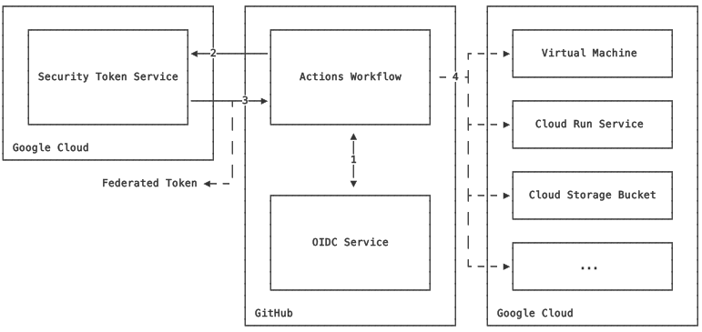

# Xplorers Backend Infrastructure

This repository contains the infrastructure code for the Xplorers backend. It is written in Terraform and uses Google Cloud Platform as the cloud provider.

## Limitations on Feature Branches for Google Cloud Services

### Technical Constraints

When working with Google Cloud services and IAM bindings, there are certain constraints that prevent the creation of feature branches for specific services. These constraints include:

1. **Global Nature of Google Cloud Services**:

    Google Cloud service APIs such as apigateway.googleapis.com, servicemanagement.googleapis.com, and servicecontrol.googleapis.com are enabled at the project level and affect the entire project. As a result, enabling or disabling these services impacts all environments within the project, making it impractical to manage them on a per-branch basis.

2. **IAM Binding Limitations**:

    IAM bindings, such as those granting the roles/secretmanager.secretAccessor role, are also applied at the project level. These bindings grant permissions to service accounts across the entire project. Managing IAM bindings on a per-branch basis would require creating and managing separate service accounts and bindings for each branch, which needs to be explored further to determine feasibility.

3. **Terraform State Management**:

    Terraform manages infrastructure as code and maintains the state of resources. When multiple branches attempt to modify the same global resources, it can lead to state conflicts and inconsistencies. This is particularly problematic for resources that are not isolated by environment or branch.

## Prerequisites

### Software

-   [Git](https://git-scm.com/downloads)
-   [Taskfile](https://taskfile.dev/#/installation)
-   [Terraform](https://learn.hashicorp.com/tutorials/terraform/install-cli)
-   [Google Cloud CLI](https://cloud.google.com/sdk/docs/install)

### Access to Google Cloud Platform

You will need access to the Google Cloud Platform to deploy the Xplorers API. If you don't have access, please contact the project owner.

Once you have access, login to Google Cloud via gcloud cli + setup application default credentials via Application Default Credentials (ADC),

Run [**_gcloud init_**](https://cloud.google.com/sdk/gcloud/reference/init) to authorize gcloud and other SDK tools to access Google Cloud using your user account credentials.

Run [**_gcloud auth application-default login_**](https://cloud.google.com/sdk/gcloud/reference/auth/login) to obtain access credentials for your user account via a web-based authorization flow. When this command completes successfully, it sets the active account in the current configuration to the account specified. If no configuration exists, it creates a configuration named default.

## Google Cloud Infrastructure

Due to the constraints mentioned above, the following Google Cloud services and IAM bindings are managed at the project level and cannot be isolated to feature branches:

### APIs & Services Enabled

-   API Gateway API
-   Service Management API
-   Service Control API
-   [#TODO: NEED TO SCOPE PERMISSIONS] Creates Google Project Bindings for,
    -   Compute service account to access Secret Manager secrets
-   [#TODO: NEED TO SCOPE PERMISSIONS] Workload Identity Pool and Provider for Google Cloud Workload Identity Federation
    -  Allows Github Actions to impersonate service account and obtain short-lived token to access Google Cloud resources

## CI/CD with Github Actions and Google Cloud Workload Identity Federation

Historically, applications running outside the Google Cloud had to rely on service account keys to access resources within the Google Cloud. However, as service account keys are long-lived credentials with permissions to interact and change the state of resources in the cloud, they pose a security risk if not managed appropriately.


Fortunately, through [workload identity federation](https://cloud.google.com/iam/docs/workload-identity-federation), external identities can be granted IAM roles directly on a resource by obtaining a short-lived federated token. This approach effectively eliminates the security and maintenance overhead associated with service account and key management.



## What is OIDC and How It Works in This Scenario

[OpenID Connect (OIDC)](https://openid.net/developers/how-connect-works/) is an identity layer built on top of the [OAuth 2.0](https://oauth.net/2/) protocol. It allows clients to verify the identity of an end-user based on the authentication performed by an authorization server, as well as to obtain basic profile information about the end-user.

In this scenario, GitHub Actions uses OIDC to securely access Google Cloud resources without the need for long-lived service account keys. Here's how it works:

1. **OIDC Token Issuance**: When a GitHub Actions workflow runs, GitHub issues an OIDC token that represents the identity of the workflow.

2. **Token Exchange**: The OIDC token is then exchanged for a short-lived access token from Google Cloud. This is done through Workload Identity Federation, which trusts the OIDC token issued by GitHub.

3. **Access Google Cloud Resources**: The short-lived access token is used to authenticate and interact with Google Cloud services. This token has a limited lifespan and specific permissions, reducing the risk associated with long-lived credentials.

By leveraging OIDC and Workload Identity Federation, this setup enhances security and simplifies credential management, ensuring that only authorized workflows can access Google Cloud resources.

## Adding CI/CD to Your Repository to Deploy Infrastructure

See example [Pull Request](https://github.com/xplorer-io/xplorers-api/pull/8) and Github Actions Run [here](https://github.com/xplorer-io/xplorers-api/actions/runs/11030637674/job/30793473258)

1. **Create a workflow file in your repository**:

    Create a GitHub Actions workflow file in your repository in location `.github/workflows/` to define the steps for deploying infrastructure to Google Cloud using Terraform. The workflow file should include the necessary steps to authenticate with Google Cloud using Workload Identity Federation.

    Example workflow file:
    ```yaml
    name: Deploy Xplorers API to GCP
    on: push

    permissions:
      contents: read
      id-token: write

    jobs:
      deploy-xplorers-api:
        name: Deploy Xplorers API to GCP
        runs-on: ubuntu-latest

        defaults:
        run:
            shell: bash

        steps:
        - name: Checkout
            uses: actions/checkout@v4

        - id: auth
            uses: google-github-actions/auth@v2.0.0
            with:
            workload_identity_provider: ${{ secrets.GOOGLE_CLOUD_WORKLOAD_IDENTITY_PROVIDER }}

        - name: Setup Terraform
            uses: hashicorp/setup-terraform@v1

        - name: Setup pnpm
            uses: pnpm/action-setup@v4
            with:
            version: 9

        - name: Install taskfile
            run: |
            sudo snap install task --classic

        - name: Terraform Plan
            run: task terraform-plan

        - name: Terraform Apply
            if: github.ref == 'refs/heads/"main"' && github.event_name == 'push'
            run: task terraform-apply
    ```

5. **Deploy Infrastructure**:
    Push the changes to your repository to trigger the GitHub Actions workflow. The workflow will authenticate with Google Cloud using Workload Identity Federation and deploy the infrastructure defined in the Terraform configuration.
